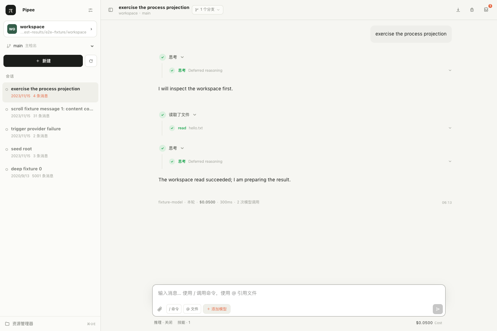

# Pipee

Pipee is the source and compatibility release repository for Pipee and its companion extensions.



## Workspaces

- `apps/pipee` — TanStack Start web host for Pi sessions.
- `apps/site` — Astro static product site deployed as Cloudflare Worker assets.
- `extensions/loop` — durable scheduled and dynamic session automation.
- `extensions/weixin` — Weixin iLink bridge bound to existing Pi sessions.
- `extensions/chrome` — Pi Chrome bridge plus its matching browser extension.
- `packages/host-runtime` — scoped host mechanisms shared by extensions, including keyed UI/media projections and runtime retention.
- `packages/extension-kit` — stateless helpers for optional Suite host capabilities and Effect Scope ownership.
- `protocols/companion-contracts` — schemas shared across the host/extension boundary.

See [Extension platform](./docs/extension-platform.md) for the ownership and lifecycle contract used
by current and future Extensions.

The four public npm packages version independently. A source change declares its public release set under `release/changes/`; packages outside that set keep their versions and are not published. The Chrome browser extension remains part of the `@yansircc/pi-chrome` release unit and shares its version. A supported release is the exact selected archive set and integrities recorded by the candidate manifest under `release/`.

## Development

```bash
pnpm install
pnpm verify
pnpm release:submit
```

`pnpm release:build-candidates -- --development` builds and packs each workspace once, records archive integrity, and marks the result non-releasable while the Git worktree is dirty. A releasable candidate requires a clean committed source tree.

`pnpm release:submit` materializes a deterministic release merge commit without changing the development branch, pushes only its `release-candidates/<sha>` ref, and dispatches the GitHub Actions witness workflow. All build, test, browser, consumer, platform, promotion, and publication gates run in Actions.

See [docs/release.md](docs/release.md) for the OIDC release transition and evidence contract.
